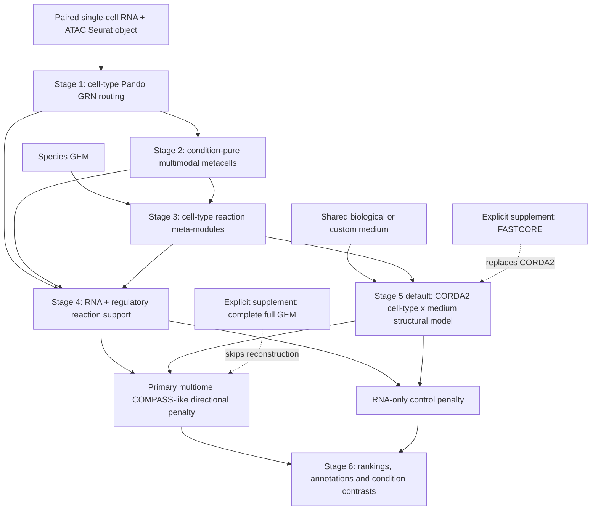

# RegCompassR

RegCompassR integrates paired single-cell RNA and ATAC regulatory evidence with cell-type-specific metabolic reaction analysis.

## Installation

```r
remotes::install_github("1667857557/Pando_regcompass")
remotes::install_github("1667857557/SuperCell_Seurat_V4")
remotes::install_github("1667857557/Regcompass")
```

## Required input

Use a paired-cell Seurat object containing:

- RNA and ATAC count assays for the same cells;
- a broad cell-type metadata column;
- RNA PCA and ATAC LSI reductions;
- genome-compatible peak coordinates;
- an optional condition column.

Stage 1 retains groups with at least 300 paired cells. Within each broad cell type, two or more retained conditions use the common-dictionary condition GRN; one retained condition uses standard Pando automatically.

## Workflow



The primary multiome score and RNA-only control reuse the same completed structural model, bounds, medium and target directions. Therefore their difference isolates the regulatory contribution rather than a change in network structure.

## Simple workflow

```r
library(RegCompassR)

result <- rc_run_regcompass_one_shot(
  object = A,
  outdir = "RegCompass_result",
  genome = BSgenome.Hsapiens.UCSC.hg38,
  species = "human",
  condition_col = "condition",
  celltype_col = "cell_type",
  pando_args = list(
    min_cells = 300L,
    pando_infer_args = list(
      tf_cor = 0.05,
      peak_cor = 0.05,
      adjust_method = "BH",
      padj_threshold = 0.05,
      rank_action = "mark",
      min_residual_df = 1L
    )
  )
)
```

The one-shot workflow prepares the species GEM and default plasma-like medium, builds cell-type-specific GRNs and condition-pure metacells, constructs reaction catalogues, calculates RNA+ATAC-informed reaction penalties, and assembles condition-level results.

Main outputs:

```r
result$grn$cell_type_analysis_mode
result$reaction_catalog
result$reaction_evidence
result$reaction_ranking
result$condition_contrast
result$reaction_comparison_by_metacell
```

## Documentation

1. [Quick run](docs/tutorial-01-quick-start.md)
2. [Stepwise run](docs/tutorial-02-stepwise-audit.md)
3. [Post analysis](docs/tutorial-04-post-analysis.md)
4. [Principles and mathematical formulas](docs/mathematical-model.md)
5. [Function reference](docs/functions.md)
